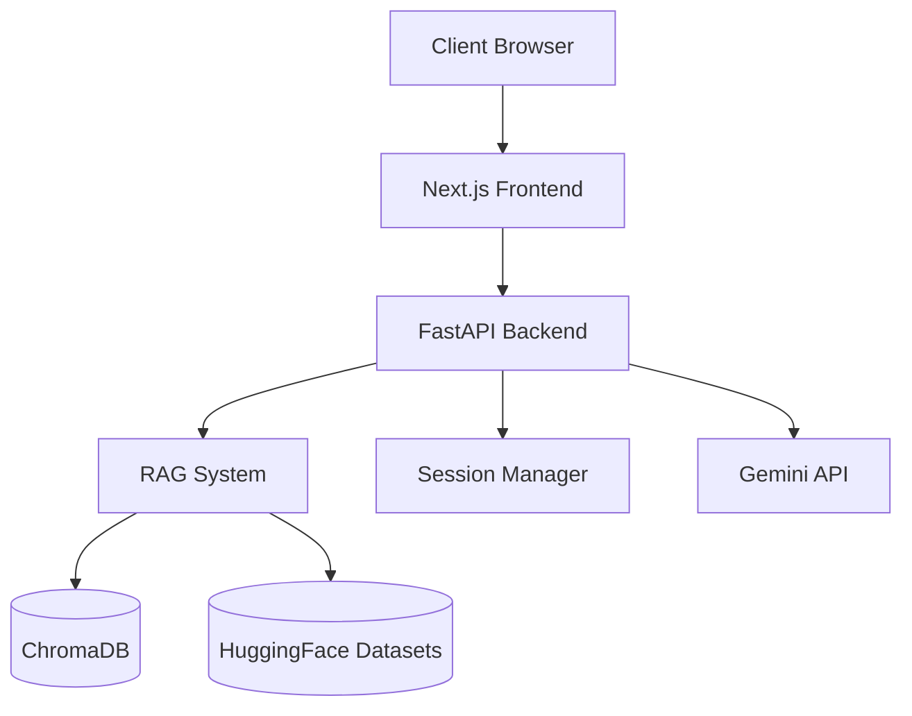
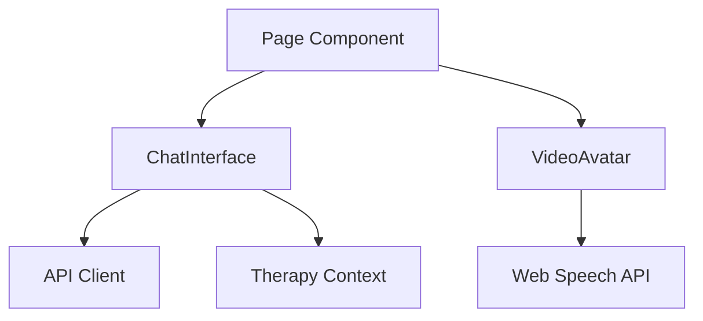
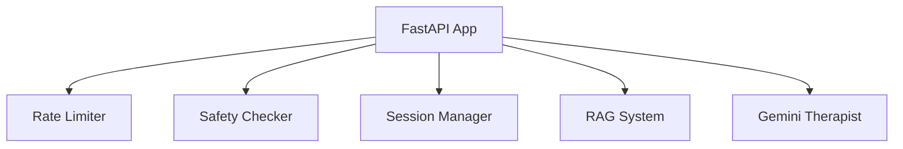
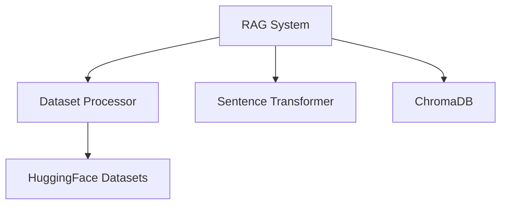
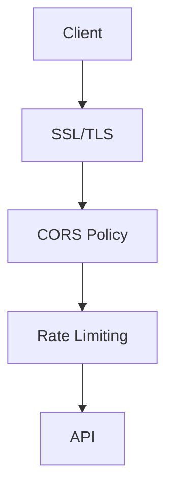
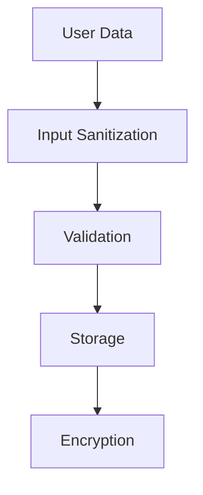
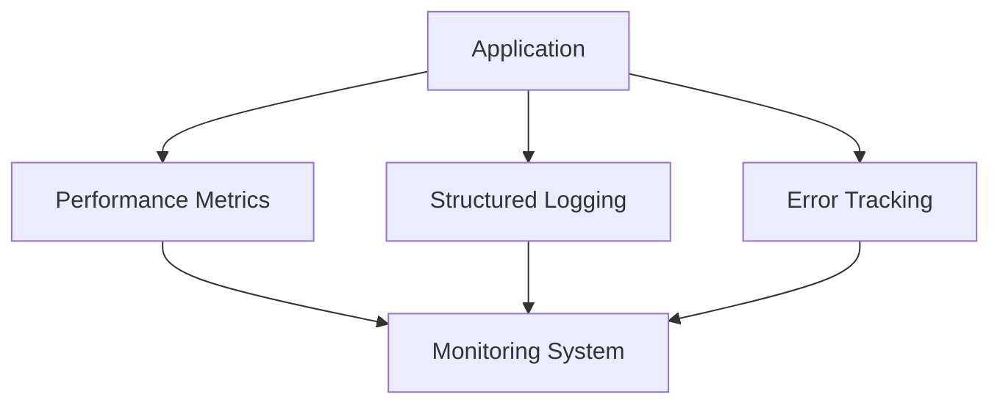
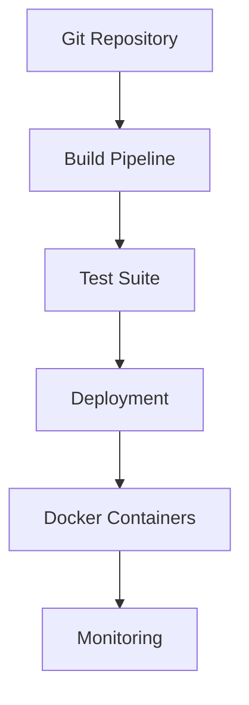

# AI Therapist System Architecture

## System Overview

The AI Therapist is a modern, scalable application built using FastAPI and Next.js, leveraging Retrieval Augmented Generation (RAG) to provide contextually relevant therapeutic responses.



## Component Architecture

### 1. Frontend Layer (Next.js)



Key Components:
- ChatInterface: Manages chat UI and interactions
- VideoAvatar: Handles AI avatar visualization
- TherapyContext: Global state management
- API Client: Backend communication

### 2. Backend Layer (FastAPI)



Key Components:
- Session Management: Handles conversation state
- RAG System: Manages retrieval and context
- Safety System: Content monitoring
- Rate Limiting: Request throttling

### 3. RAG System



Features:
- Multiple dataset support
- Efficient vector search
- Contextual retrieval
- Incremental updates

## Data Flow

### 1. Chat Flow

```sequence
User->Frontend: Send message
Frontend->Backend: POST /api/chat
Backend->Safety: Check content
Backend->RAG: Get context
Backend->Gemini: Generate response
Gemini->Backend: Response
Backend->Frontend: Chat response
Frontend->User: Display message
```

### 2. RAG Initialization

```sequence
Admin->Backend: Initialize RAG
Backend->HuggingFace: Load datasets
Backend->Processor: Process data
Processor->Embeddings: Generate vectors
Embeddings->ChromaDB: Store vectors
ChromaDB->Backend: Confirmation
Backend->Admin: Success response
```

## Security Architecture

### 1. Network Security



### 2. Data Security



## Monitoring & Logging



## Scalability Considerations

1. Horizontal Scaling
   - Stateless API design
   - Distributed vector storage
   - Load balancing support

2. Performance Optimization
   - Response caching
   - Batch processing
   - Efficient vector search

3. Resource Management
   - Connection pooling
   - Memory optimization
   - Background task queuing

## Deployment Architecture



## Future Enhancements

1. System Scalability
   - Redis for session management
   - PostgreSQL for persistent storage
   - Kubernetes deployment

2. Feature Additions
   - Real-time chat (WebSocket)
   - Voice interaction
   - Multi-language support

3. Security Enhancements
   - OAuth integration
   - End-to-end encryption
   - Advanced auditing

## Development Workflow

1. Local Development
   - Docker Compose setup
   - Hot reload enabled
   - Environment isolation

2. Testing Strategy
   - Unit tests
   - Integration tests
   - E2E testing

3. Deployment Process
   - CI/CD pipeline
   - Staging environment
   - Production deployment